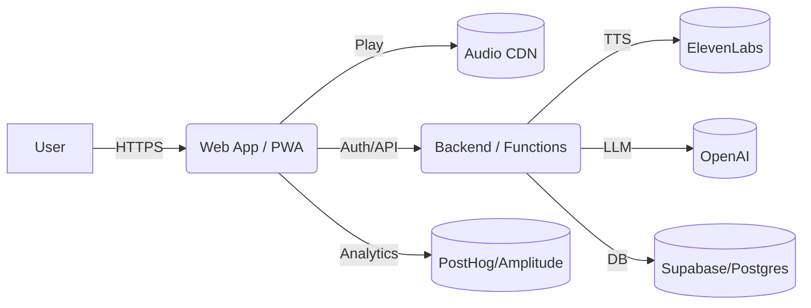

# Mindful • Calming • Focused — Meditation App

Live App: https://mindful-calming-focused.deploypad.app

## 🚦 Project Snapshot (fill now)
- Goal: ...
- Stack: Famous.ai + ...
- Critical features: ...
- Monetization: ...
- Content pipeline: ...
- Mobile plan: ...
- 30–60‑day roadmap: ...

## 🧱 Repo Structure
- app/ — exported app source
- public/ — static assets (privacy/terms)
- docs/ — architecture & AI plan
- scripts/ — ops scripts
- .env.sample — template env vars (no secrets)

## 🔧 Quickstart
cp .env.sample .env.local
# fill values, keep secrets local

## 📐 Architecture (Mermaid)
